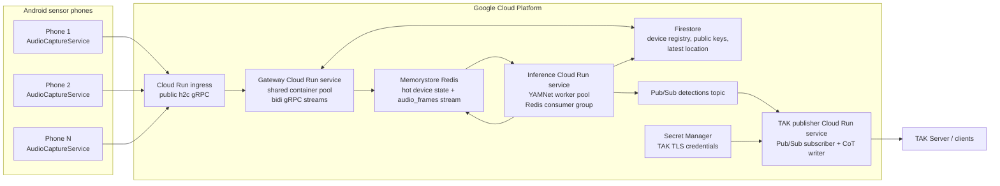

# Drone Audio Sensor System

Android + Google Cloud system for continuous drone audio detection using YAMNet, with TAK/CoT dissemination.

## Repository layout

```
proto/                  Shared gRPC/protobuf contract (Android, backend, TAK publisher)
android/                Dedicated-device sensor app (Keystore-backed JWT auth, kiosk-capable)
backend/gateway/        Python asyncio gRPC gateway service (validates device JWTs)
backend/inference/      YAMNet inference worker pool
backend/tak_publisher/  Pub/Sub -> CoT/TAK Server bridge
iac/terraform/          GCP infrastructure as code (services, IAM, dashboards, alerts)
scripts/                Admin tooling (provision_device.py)
docs/                   Operator documentation (PROVISIONING, MDM_ENROLLMENT, RUNBOOK, SECURITY)
```

## Architecture



Each phone keeps one long-lived gRPC stream open to the gateway, but Cloud Run
container instances are shared pools, not one container per phone. The gateway
multiplexes many phone streams, writes audio frames to the Redis stream, and
inference workers split that stream through a Redis consumer group. Only
confirmed detection events move through Pub/Sub to the TAK publisher.

## Session 1 — Phone-side streaming core

Delivered:

- `proto/drone_audio.proto` — full gRPC service + message contract
- Android Gradle project (Kotlin, gRPC-OkHttp, protobuf-lite)
- `AudioCaptureService` — foreground service, 16 kHz mono PCM, 1-second frames
- `StreamingClient` — persistent bidi gRPC stream, handshake-then-frames, exponential backoff with jitter, ServerCommand handling
- `BootReceiver` — auto-launches the service on `BOOT_COMPLETED`
- `MainActivity` — minimal status screen with state/metrics
- `DeviceIdentity` — UUID-backed device ID (Keystore-backed identity comes in Session 5)
- `DeviceHealthSnapshot` — battery, network, thermal, queue depth

## Building

Open the `android/` directory in Android Studio (Iguana or newer). Sync Gradle, then run on a device with API 28+.

To build from CLI you'll need Android SDK installed and `local.properties` pointing at it. From `android/`:

```
gradle wrapper                       # first time only, if no gradlew present
./gradlew :app:assembleDebug
```

## Configuring the gRPC endpoint

The default endpoint is `10.0.2.2:50051` (Android emulator → host machine), plaintext. Override via `BuildConfig` constants in `app/build.gradle.kts` or programmatically via `AppConfig.endpoint`. TLS support is wired but disabled by default for R&D.

## Session 2 — Cloud gateway + Terraform skeleton

Delivered:

- `backend/gateway/` — Python asyncio gRPC server: validates handshake, persists device registration to Firestore, tracks hot state in Redis, emits FrameAcks every N frames, handles disconnect cleanup
- `backend/gateway/Dockerfile` — multi-stage build that generates Python proto stubs in-image
- `iac/terraform/` — VPC + connector + Memorystore + Firestore + Pub/Sub + Secret Manager + Artifact Registry + service accounts + Cloud Run v2 gateway service with h2c port and persistent stream timeouts

See [iac/terraform/README.md](iac/terraform/README.md) for the deploy walkthrough.

## Session 3 — YAMNet inference worker

Delivered:

- Gateway now publishes each `AudioFrame` to a Redis Stream (`audio_frames`) with a configurable maxlen
- `backend/inference/` — long-running worker consuming the stream via a consumer group, running YAMNet (TF Hub `yamnet/1`) on each 1-second clip, maintaining a per-device score ring buffer, applying a K-of-N + average smoothing rule, and publishing confirmed detections to the existing Pub/Sub topic
- Suppression window prevents alert storms from a single device
- Detection event JSON includes device location (looked up from Firestore), per-class scores, and model identification
- Cloud Run service for inference workers with HTTP/2 health probes, VPC egress to Memorystore, internal-only ingress

## Session 4 — TAK publisher + Android hardening

Delivered:

- `backend/tak_publisher/` — Pub/Sub pull subscriber bridges into asyncio, dedupes by `detection_id` (LRU), converts each event to a Cursor-on-Target XML payload, and writes to a persistent TLS socket to the TAK Server
- Reconnect with exponential backoff + jitter; ack only after the TAK write succeeds (so failed writes redeliver via Pub/Sub → DLQ)
- TAK Server credentials loaded from Secret Manager (PEM blobs) at startup
- Pub/Sub subscription on the detections topic with DLQ and configurable max-delivery-attempts
- New Cloud Run service for the TAK publisher with health probes and Secret Manager IAM binding
- Android: `LocationProvider` (LocationManager-based, no Play Services dep), `AudioWatchdog` (auto-restarts capture on stall), `HealthReporter` (periodic DeviceHealth heartbeats)
- `StreamingClient` now accepts a `LocationProvider`, includes location in the handshake, and forwards `LocationUpdate` + periodic `DeviceHealth` messages over the bidi stream
- Manifest: ACCESS_FINE/COARSE/BACKGROUND_LOCATION + FOREGROUND_SERVICE_LOCATION; service `foregroundServiceType="microphone|location"`
- MainActivity now also requests `ACCESS_FINE_LOCATION`

## Session 5 — Security, kiosk mode, ops

Delivered:

- **Hardware-backed device identity** — `DeviceIdentity` now generates an EC P-256 keypair in `AndroidKeyStore` (StrongBox when available). The private key never leaves the secure element. Public key exported as PEM for admin registration.
- **JWT-based device auth** — `JwtSigner` builds ES256 JWTs (header.payload.sig with raw R||S signatures) bound to the device's Keystore key. Attached as `Authorization: Bearer` on every gRPC channel via a `MetadataUtils` interceptor.
- **Gateway JWT validation** — `auth.py` validates ES256 signatures against per-device public keys looked up from Firestore, cached for 5 min. Toggle via `GATEWAY_REQUIRE_AUTH`. Rejects when `sub != kid` or device is revoked.
- **Admin provisioning CLI** — `scripts/provision_device.py` registers / revokes / lists / inspects devices in Firestore.
- **Device Owner + kiosk** — `DeviceOwnerReceiver` + `KioskController` add lock-task mode, persistent HOME, keyguard disable when the app is set as device owner. Manifest and device-admin XML policies registered.
- **Comprehensive monitoring** — Six alert policies (5xx, p95 latency, instance saturation, Redis memory, Pub/Sub backlog, DLQ presence) + a six-tile dashboard via `google_monitoring_dashboard`.
- **Operator docs** — [`docs/PROVISIONING.md`](docs/PROVISIONING.md) · [`docs/MDM_ENROLLMENT.md`](docs/MDM_ENROLLMENT.md) · [`docs/RUNBOOK.md`](docs/RUNBOOK.md) · [`docs/SECURITY.md`](docs/SECURITY.md) · [`docs/DASHBOARD.md`](docs/DASHBOARD.md)

## Session roadmap

1. ✅ Proto + Android streaming core
2. ✅ Cloud gateway + Terraform skeleton
3. ✅ YAMNet inference worker
4. ✅ TAK/CoT publisher + Android hardening
5. ✅ Security, kiosk mode, ops, docs

## What's still outside scope

- **Custom drone classifier** — still using YAMNet's raw `Drone` AudioSet class. Training a small head on YAMNet embeddings against negative sounds (helicopters, lawn equipment, HVAC) is the next quality lever.
- **Multi-sensor localization** — markers placed at sensor lat/lon, not at estimated drone location.
- **Zero-touch enrollment loop** — manual ADB provisioning works today; Android Management API path is documented but not automated end-to-end.
- **Notification channels for alert policies** — the alert policies have no `notification_channels` configured; create channels in the console and edit `monitoring.tf` to attach them.
