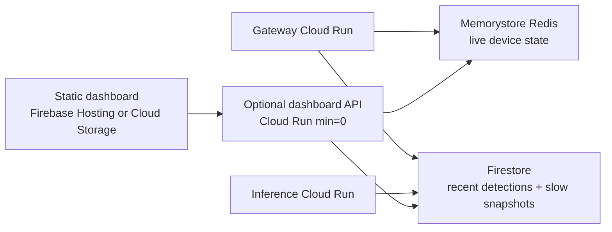

# Low-Cost Status Dashboard

This system can add a lightweight web dashboard for current phone connections
and recent detections without introducing SQL or a continuously running web
server.

## Goal

Show:

- currently connected phones
- last-seen time, site label, and latest location for each phone
- detection hits from the last hour
- basic score/model metadata for each hit

## Cheapest Architecture



Use Redis for high-frequency live status and Firestore for low-frequency,
queryable records:

- Redis keeps live connection state and can be updated on every frame or
  heartbeat.
- Firestore stores confirmed detections and slower device snapshots.
- A static dashboard reads a compact status API, or reads Firestore directly if
  Firebase auth/rules are configured.

## Data Model

Keep existing `devices/{device_id}` documents for slow snapshots:

```json
{
  "device_id": "DRONE-SENSOR-1234ABCD",
  "status": "active",
  "session_id": "...",
  "assigned_site_label": "Site A",
  "last_seen_ms": 1735692000000,
  "current_location": "GeoPoint",
  "location_accuracy_m": 8.5
}
```

Add `detections/{detection_id}` for dashboard history:

```json
{
  "detection_id": "...",
  "device_id": "DRONE-SENSOR-1234ABCD",
  "site_label": "Site A",
  "timestamp_ms": 1735692000000,
  "average_score": 0.72,
  "peak_score": 0.91,
  "model_name": "yamnet",
  "model_version": "1",
  "expires_at": "Firestore TTL timestamp"
}
```

Use Firestore TTL on `expires_at` if only recent hits are needed. A one-day TTL
is usually easier to operate than exactly one hour; the dashboard can still
query only the last hour.

## Cost Notes

The dashboard should be a small cost compared with audio inference.

- Static hosting is usually free or pennies for low internal traffic.
- Firestore detection writes are cheap when detections are rare.
- A request-based Cloud Run dashboard API with `min_instances = 0` should cost
  near zero for light use.
- Do not write every device heartbeat to Firestore. At 1,000 phones and one
  write every 30 seconds, that would be about 2.88 million writes per day.

Recommended write policy:

- update Redis on every frame/heartbeat
- write Firestore device snapshots every 1-5 minutes, or only on meaningful
  status/location changes
- write Firestore detection documents only for confirmed detections

## Implementation Path

1. Extend the inference publisher to also write each confirmed detection to
   Firestore `detections/{detection_id}` with `timestamp_ms` and `expires_at`.
2. Add a small dashboard API Cloud Run service with `min_instances = 0`.
3. Implement `/status` by reading Redis live device keys plus Firestore
   detections from the last hour.
4. Host a static HTML/JS dashboard on Firebase Hosting or Cloud Storage.
5. Add auth before exposing the dashboard outside a trusted network.

This keeps the first version cheap and avoids adding Cloud SQL, BigQuery, or a
new persistent database.
